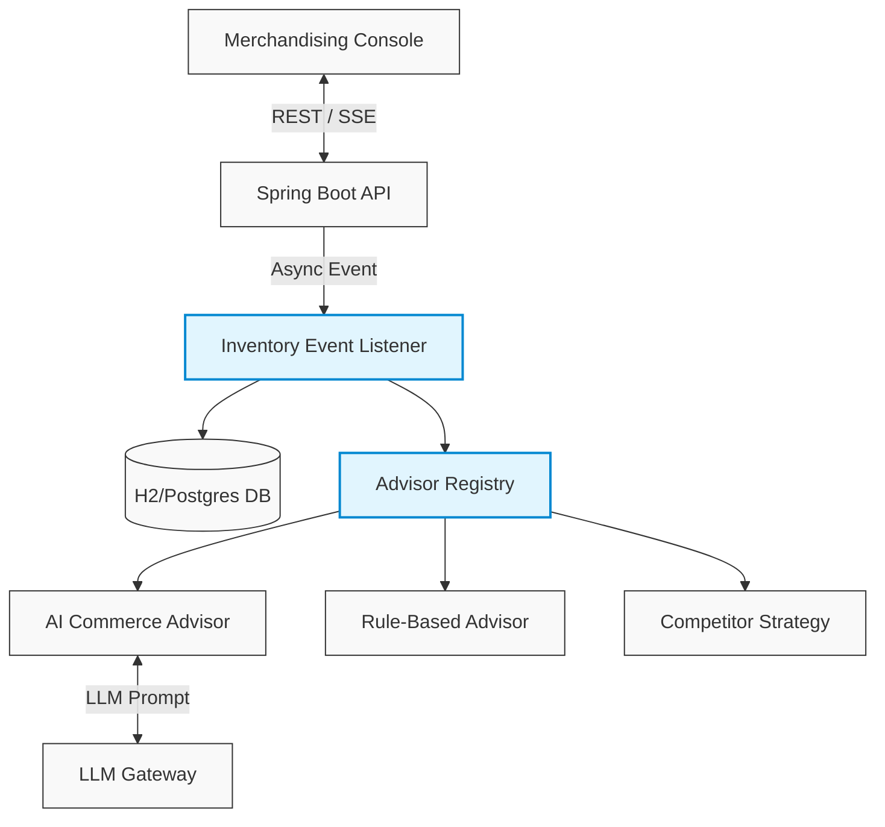

<div align="center">
  
  <h1 align="center">StockPulse</h1>
  <p align="center"><strong>Reactive Agentic Commerce Advisor</strong></p>

  <p align="center">
    <a href="https://spring.io/projects/spring-boot"></a>
    <a href="https://react.dev/"></a>
    <a href="https://maven.apache.org/"></a>
    <a href="https://www.h2database.com/"></a>
  </p>
  
  <p align="center">
    When stock drops or demand spikes, StockPulse detects it, reasons about it, and queues actionable intelligence for your merchandising team.
  </p>
</div>

---

## 📖 Table of Contents
- [About the Project](#about-the-project)
- [System Architecture](#system-architecture)
- [🚀 5-Minute Quickstart](#-5-minute-quickstart)
- [🎮 Interactive Demo Paths](#-interactive-demo-paths)
- [📐 Architecture & Design Decisions](#-architecture--design-decisions)
- [🛠️ Tech Stack](#️-tech-stack)

---

## About the Project

**StockPulse** bridges the gap between reactive inventory triggers and intelligent pricing strategies. Traditional commerce systems fail silently when products go viral or stock depletes rapidly, leaving merchandising teams reacting hours or days too late. 

StockPulse flips the paradigm:
1. **Observe**: Listens asynchronously to high-volume inventory events (sales, velocity spikes).
2. **Reason**: Injects context into an AI LLM (or a highly configurable rule-based engine) to determine the optimal price change or reorder quantity.
3. **Propose**: Surfaces high-confidence recommendations with plain-English reasoning to the dashboard.
4. **Act**: Merchandisers approve with a single click, instantly syncing the global state.

---

## System Architecture



---

## 🚀 5-Minute Quickstart

This project is built to run flawlessly on your local machine with zero complex setup. It ships with an in-memory database pre-seeded with catalog and inventory data.

### Prerequisites
- **Java 17+**
- **Node.js 18+**
- **Maven**

### 1. Start the Backend Engine

```bash
cd stockpulse-backend
```

**[Optional but Recommended]** Export your Gemini (or Groq/Ollama) API Key. 
> 💡 *If you skip this step, the system gracefully falls back to a deterministic Rule-Based Strategy!*

```bash
# Windows (PowerShell)
$env:LLM_API_KEY="your_api_key_here"

# Mac/Linux
export LLM_API_KEY="your_api_key_here"
```

Start the Spring Boot server:
```bash
mvn spring-boot:run
```
*(Runs on `http://localhost:8080`)*

### 2. Start the Merchandising Console

Open a **new** terminal window:
```bash
cd stockpulse-frontend
npm install
npm run dev
```
*(Runs on `http://localhost:5173`)*

---

## 🎮 Interactive Demo Paths

Open the frontend dashboard at `http://localhost:5173`. 

### Scenario 1: Low Inventory (Margin Protection vs Clearance)
1. Locate **PRD-003 (Organic Cotton T-Shirt)** in the live catalog.
2. Note that it currently has `8` units of stock (Threshold: `15`). Click **"Simulate Sale"**.
3. Watch the right sidebar. The Agentic Loop intercepts the stock event asynchronously and queues a **Price Adjustment** and **Reorder Recommendation**.
4. Observe the **Live Reasoning Stream** evaluating clearance vs. margin tradeoffs.
5. Click **Approve Action** and watch the catalog instantly update.

### Scenario 2: Viral Demand Spike
1. Locate **PRD-008 (Hoodie — Heather Grey)**.
2. Click **"Simulate Sale"** 3-4 times rapidly.
3. The system detects the velocity crossing the category average and triggers the **DEMAND_SPIKE** event, surfacing new AI suggestions to capitalize on the momentum.

### Scenario 3: Hot-Swapping Strategies (Sprint 2 Ready)
1. At the top of the dashboard, toggle to the **Competitor Strategy**.
2. Simulate a sale on any product.
3. Observe how the system instantly hot-swaps to an entirely new set of commerce logic (scraping mocked competitor prices) **without a JVM restart**, proving the architectural resilience of the `AdvisorRegistry`.

---

## 📐 Architecture & Design Decisions

We believe in documenting the *why*, not just the *how*. 

Please read the **[Architecture Decision Records (ADR)](./stockpulse-backend/ADR.md)** in the backend directory for a detailed breakdown of critical architectural decisions, including:
- **Unified vs Split AI Contracts**: Why we spend extra tokens for structural resilience.
- **LLM Graceful Degradation**: How we handle timeouts, bad JSON, and absent API keys.
- **Idempotency & Concurrency**: How pessimistic locking and event-driven architecture prevent duplicate AI calls during heavy load.
- **Event Sourcing**: How we maintain immutable ledgers of price changes.

---

## 🛠️ Tech Stack

**Backend**
- Spring Boot 3.x (Web, Data JPA)
- Java 17
- H2 In-Memory Database (Postgres-ready)
- Server-Sent Events (SSE) for UI Streaming

**Frontend**
- React 18
- Vite
- Tailwind CSS
- Lucide Icons
